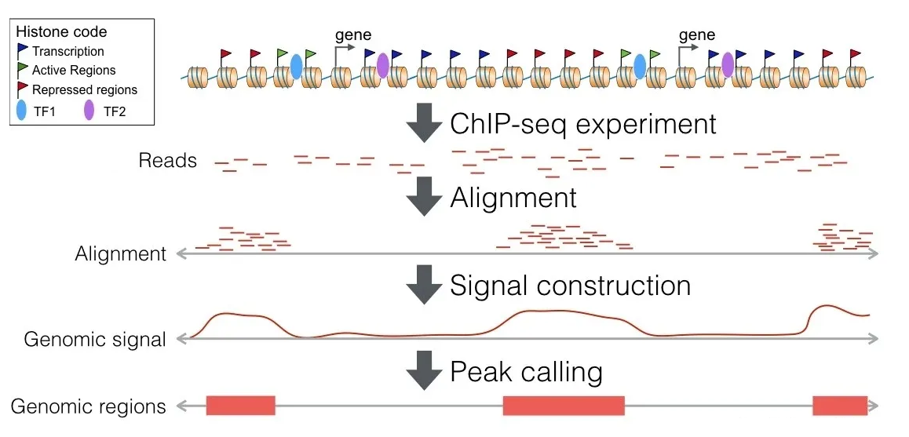

# A
*Ablation experiment*    
Similar to “Control variables”:    
Suppose you use A, B, C in a target detection system, and you get a good result, but at this point you don't know which of A, B, and C is responsible for the good result, so you keep A, B, doing experiment by removing C to see what C does in the overall system.

*Adaptive suites*      
指一组相关的特征，这些特征共同进化，被认为是适应或有益于特定环境中的生物体。适应性套件可以根据生物体的环境或行为的变化而出现，并且可以涉及受复杂交互作用影响的多种特征的变化。    ^c268df

*Anaemia*    
Not Enough red blood cells carry enough oxygen throughout the body, leading to a lack of oxygen in the organs.     
There are more than 400 types of anaemia, and they’re divided into three groups:
+ Caused by blood loss
+ Caused by decreased or faulty red blood cell production
+ Caused by destruction of red blood cells    

Normocytic normochromic anaemia (NN anaemia) : red blood cells are normal in shape and size, tending to accompany certain chronic diseases. ^1fa2b1

*ATAC-seq*     
**A**ssay for **T**ransposase-**A**ccessible **C**hromatin with high-throughput **seq**uencing.    
用于检测基因组`染色质可及性`的分子生物学手段:    
此方法依赖于下一代测序（NGS），使用高活性突变型 Tn5 转座酶将扩增引物插入开放的染色质，之后对这些区域进行扩增，以知道哪些区域是开放（可及）的。 ^7afcc6
> DNA 的复制和转录都需要将染色质紧密结构打开，从而**允许调控因子结合 DNA**。 这部分被打开的染色质，就叫开放染色质区域（Open Chromation region,**OCR**）。
  开放染色质允许调控因子结合的特性称为染色质的可接近性（Chromatin Accessibility）。

# B
_BLAST_    
Basic Local Alignment Search Tool, an algorithm for comparing primary structures of biological sequences, such as amino acid sequences of different proteins or DNA sequences of different genes.
+ BLASTp: Search for protein sequence using `protein database`
+ BLASTn: Searching for nucleotide sequence using `Nucleotide database`
+ BLASTx: The given nucleic acid sequence is translated into protein according to six reading frames and compared with the sequence in the `protein database`
+ tBLASTn: The given amino acid sequence is compared with the sequence (double-stranded) in the `Nucleotide database` according to different reading frame

# C

*ChIP-Seq*    
首先通过染色质免疫共沉淀技术（ChIP）特异性地富集目的蛋白结合的 DNA 片段，并对其进行纯化与文库构建；然后对富集得到的 DNA 片段进行高通量测序。

*Cluster of differentiation (CD)*   
A protocol used for the identification and investigation of cell surface molecules providing targets for immunophenotyping of cells. Most of them are transmembrane proteins or glycoproteins on cell membrane

*CMV*  
Cytomegalovirus is a common virus that infect people of all ages. Infection usually occur in the salivary (唾液的) glands.

The most studied is human Cytomegalovirus (HCMV), also known as human herpesvirus type B 5(HHV-5). Other primate species that have CMV include chimpanzees (CCMV).

# D
*Drosophila*     
Two species in [0-1](0-1 Differences in orthodenticle expression promote ommatidial size variation between Drosophila(drə'sɒfɪlə) species):
+ Drosophila mauritiana
+ Drosophila simulans     

# E
*EBV*   
Epstein–Barr virus (or Human herpesvirus 4, HHV-4) is one of the most common human viruses in the world. Main route of infection is oral transmission of saliva or reproductive secretions.

*E-values*     
Expect value, Represents the probability of a random match.   
The greater the E value, the greater the chance of a random match. E is close to zero, it is essentially a perfect match.   
There is also a bit score (S) -  the higher the bit score, the greater the similarity.
S can be computed using the formula below:
$$
S = \frac{\lambda R - \ln_{}{K} }{\ln_{}{2} } 
$$
where λ is the Gumble distribution constant, R is the raw alignment score, and K is a constant associated with the scoring matrix.

E can be computed using:
$$
E = mn2^{-s}  
$$
where m is the effective length of the query, n is the effective length of the database, and 2^-s also called P-value (Probability that an event occurs by chance)

*Eye imaginal discs*       
Are a part of the Drosophila melanogaster (fruit fly) larva's eye development. They are small, round structures that are found on the surface of the larva's head and are involved in the formation of the fly's eyes. ^33e88a

*Exine*
The decay-resistant outer coating of a pollen grain or spore

# F
*Ficolin - 纤维胶凝蛋白*      
A group of oligomeric lectins with N-terminal collagen-like domain and a C-terminal fibrinogen-like domain. Together with pentraxins, collections and C1q molecules they are the soluble pattern-recognition molecules (PRMs) which play an important role in humoral innate immunity  ^0dc3df

*Fourfold degenerate site - 4倍简并位点*
一个遗传密码子通常由三个核苷酸构成，每个核苷酸称为一个位点（position），从左到右依次为第一位点、第二位点、第三位点。如果密码子的某个位点上任何核苷酸都编码同样的氨基酸，则称这个位点为 4 倍简并位点。例如甘氨酸密码子（GGA, GGG, GGC, GGU）的第三个位点就是一个 4 倍简并位点。只有某些密码子的第三个位点可能是 4 倍简并位点。
# G
*Genetic marker* 
Genetic marker is a DNA sequence with a known physical location on a chromosome, which can be used to identify individual organisms or species.

*Gene Ontology* 
Ontology: a set of concepts and categories in a subject area or domain that shows their properties and the relations between them.
其必须的四个元素是：
+ 概念 (concepts) 
+ 关系 (relations) 
+ 实例 (instances) 
+ 公理 (axioms)

从三个方面（GO domains）描述了我们对生物学领域的了解：
+ molecular function - 单个的基因产物（包括蛋白质和 RNA）或多个基因产物的复合物在分子水平上的活动，如 “催化”，“转运”
+ cellular component - 基因产物在执行功能时所处的细胞结构位置，如线粒体，核糖体
+ biological process - 通过多种分子活动完成的生物学过程，如DNA 修复；更加具体，如葡萄糖跨膜转运

GO 里面的每一个 entry 都有一个唯一的数字标记，形如 GO: 0011223；  
Term 是 GO 里面的基本描述单元（属于一个domain）

# H
*Haematopoiesis*     
The formation of blood cellular components. All cellular blood components are derived from haematopoietic stem cells.
Lymphopoiesis is more formally known as lymphoid haematopoiesis.

*Hemoglobin*    
Hemoglobin is a protein in red blood cells that carries oxygen.

*Heterochrony - 异时发生*      
Heterochrony is the evolutionary change in the rate or timing of developmental events. It can lead to differences in the size, shape, and function of structures and organs between individuals within a species, or between different species.

*Hits*    
Running BLAST, return the hits. A sequence search will (hopefully) identify sequences that are similar (or even identical) to the queries. The identified sequences are often called the hit sequences (or just hits).

# I
*Innate Lymphoid Cell (ILC)*     
ILCs are a group of immune cells that are distributed throughout the body and are enriched in mucosal structures such as the skin, lungs, and digestive tract. Adipose tissue and lymph nodes are also abundant, playing an important role in innate immune regulation and tissue remodelling.   
There is no antigen specific receptor on its surface, so its maturation does not depend on RAG protein.

ILC cells can be divided into three groups: ILC1,2 and 3:
+ ILC1 produces IFN-γ and matures with T-bet transcription factor
+ ILC2 produces type-cytokines such as IL-5 and IL-13, and matures with GATA3 transcription factor
+ ILC3 consists of lymphoid tissue-inducing cells (LTI) that secrete IL-17 and IL-22 cytokines and mature on ROR γ transcription factor.

*Interommatidial angles - 环视角*     
The Angle of eye movement in horizontal and vertical directions

*Introgression*     
The process by which genes from one species are introduced into the gene pool of another species through interbreeding.

*in situ hybridization - 原位杂交*     
核酸杂交技术的一种方式。其使用标记的互补 DNA，RNA 或修饰的核酸链定位组织的一部分或部分中的特定 DNA 或 RNA 序列。如果组织足够小，也可以定位整个组织，细胞和循环肿瘤细胞。 ^51111e

# J

# K

# L

# M
*Mushroom bodies*    
Also called corpora pedunculata, are a pair of structures in the brain of insects, other arthropods, and some annelids. Olfactory and visual signals are integrated here, so they are essential for learning and memory

*Microsynteny - 微同步*      
Small regions of synteny identified between two or more genomic regions.

# N
*Nectar; Pollen*    
花蜜；花粉

# O
*Ommatidium - 小眼*      
复眼 (compound eyes)的组成部分，是一个细小的独立感光组织，能够分辨光暗及颜色。 ^b620ba

*Orthodenticle*       
Or  called ==Otd==, a `homeobox` gene found in Drosophila that regulates the development of anterior (前部) patterning, with particular involvement in the central nervous system function and eye development.     ^ef05d9
>  homeobox        
   同源（异形）框, Hox 基因是一系列「基因群」的代称，負責調控體節和附肢的發育。在這些基因的开头有一段相似性极高的保守序列，此段序列称为Homeobox

# P
*Peak calling*      
A computational method used to identify areas in a genome that have been enriched with aligned reads (for example, after ChIP-sequencing or MeDIP-seq)   
Simply, it is the step to find the DNA binding sites.
 ^507f25

*Proboscis*      

*Properdin - 备解素/P因子*    
A protein binds to bacterial cell walls and dying human cells to stabilize the C3 and C5-convertase enzyme complexes to form an attack complex that lead to the lysis of the cell. ^8e500b

# Q
*Quantitative trait loci (QTL) - 数量性状基因座*        
QTLs are regions of DNA that are associated with the variation of quantitative traits, which are traits that can be measured on a continuous scale, such as height or weight. ^367406
>QTL mapping?    
  Identify the genetic basis of trait variation
  估算数量性状的基因位点树目、位置和遗传效应。

# R
*Recombination-activating genes (RAGs)*     
Indispensable for gene fragments rejuvenation of Immunoglobulin (IG) and T lymphocyte receptors (TCR).  
Divided into 2 types.: RAG1 and RAG2, respectively, were encoded by recombinant enzymes of RAG1 and RAG2. The limited expression of RAG1 and RAG2 in developing lymphocytes is an important component of **adaptive immune** system.

*Receptor tyrosine kinase (RTKs)*     
A kind cell surface receptor that have high affinity for a wide variety of polypeptide growth factors, cytokines, and hormones. It's both a receptor and an enzyme. ^c96c7f

# S

*Sense codon*
Sense codons are codons that encode proteins. The 61 sense codons specify 20 typical amino acids

*Synchrotron radiation micro CT - 同步辐射 X 射线显微断层扫描技术*     
A new imaging technology. Compared with the common X-ray scanning technology, SR-μct has the characteristics of high spatial resolution, high material discrimination and quantitative structures  ^47a5f9

# T

*Twofold degenerate site - 2倍简并位点*
如果密码子的某个位点上只有四个可能核苷酸其中的两个在该位点时编码同一个氨基酸，那么这个位点就是 2 倍简并位点。例如谷氨酸密码子（GAA, GAG）的第三位点就是 2 倍简并位点，因为密码子（GAA, GAG）的第三位点上是 A 或 G 都编码谷氨酸，而变成其他核苷酸则不再编码谷氨酸。

# U

# V

# W

# X

# Y

# Z
*Zymogen*     
Some enzymes are not catalytic when they are first secreted. This inactive precursor is called zymogen
