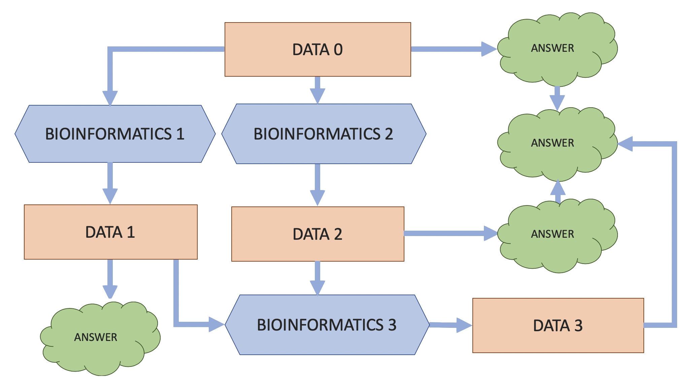

# Data?
The simplest definition relies on clarifying that “data” and “data format” are closely related concepts:  
1.  A symbolic representation of **information**.  
    信息的符号化表示。
2.  A **design**, and **optimization** of that information.  
    一个设计，以及对该信息的优化。

>了解数据格式，每种格式编码什么信息，以及什么时候使用一种格式比另一种格式合适是生物信息学家的一项基本技能。

## How life scientists think about bioinformatics


## What bioinformatics is in reality 
作为一个生物信息学家，你需要理解只有数据。软件工具只是将数据从一种格式转换成另一种格式。新的，产生的数据通常会有不同的 "优化"。它可能更丰富，因为它可能包含其他数据的信息组合。但它仍然是数据 -- 而生物洞察力来自于对这些数据的理解和调查。



## What kind of problems does bioinformatics data have?
人类基因组计划，在 2000 年 "完成" 。但十年后，我们意识到这项工作还没有完全完成，but that the [best is yet to come](https://www.nature.com/articles/470140a)

### Which human reference genome to use 
[参考17年的文章](http://lh3.github.io/2017/11/13/which-human-reference-genome-to-use)

在 "完成" 人类基因组计划近 20 年后，我们很难决定应该从 "哪个" 人类基因组开始使用。许多已发表的和广泛使用的基因组学构建包含不一致之处，使得在它们之间比较结果更具挑战性和不可靠。所有这些 "构建" 被同时用来产生越来越多的信息，所有这些信息被 "混合" 在一起，传播着错误和不一致的地方。

## How complete is the data that will I obtain?
获取人类基因组 [22 号染色体](http://hgdownload.cse.ucsc.edu/goldenPath/hg38/chromosomes/)的序列数据：
```bash
# Download and unzip the file on the fly.
curl http://hgdownload.cse.ucsc.edu/goldenPath/hg38/chromosomes/chr22.fa.gz | gunzip -c > chr22.fa

# Look at the file
cat chr22.fa | head
```

print: 
```
>chr22
NNNNNNNNNNNNNNNNNNNNNNNNNNNNNNNNNNNNNNNNNNNNNNNNNN
NNNNNNNNNNNNNNNNNNNNNNNNNNNNNNNNNNNNNNNNNNNNNNNNNN
NNNNNNNNNNNNNNNNNNNNNNNNNNNNNNNNNNNNNNNNNNNNNNNNNN
NNNNNNNNNNNNNNNNNNNNNNNNNNNNNNNNNNNNNNNNNNNNNNNNNN
NNNNNNNNNNNNNNNNNNNNNNNNNNNNNNNNNNNNNNNNNNNNNNNNNN
NNNNNNNNNNNNNNNNNNNNNNNNNNNNNNNNNNNNNNNNNNNNNNNNNN
NNNNNNNNNNNNNNNNNNNNNNNNNNNNNNNNNNNNNNNNNNNNNNNNNN
NNNNNNNNNNNNNNNNNNNNNNNNNNNNNNNNNNNNNNNNNNNNNNNNNN
NNNNNNNNNNNNNNNNNNNNNNNNNNNNNNNNNNNNNNNNNNNNNNNNNN
```
`N` 代表 "未知碱基"

查看碱基信息：
```bash
$ infoseq chr22.fa

Display basic information about sequences
USA                   Database  Name  Accession Type   Length    %GC 
fasta::chr22.fa:chr22    -      chr22      -     N    50818468  47.69
```

这意味着， 在`chr22` 的 5000 万个碱基中，有 1100 万个（~23%）目前是未知的。虽然其中有一些 DNA 片段已经被测序，但还没有被定位。通常这些区域会落入中心粒和端粒。这些未定位的片段可能会被单独分布。

## Major DNA data repositories
-   [NCBI: National Center for Biotechnology Information](http://www.ncbi.nlm.nih.gov/)
-   [EMBL: European Molecular Biology Laboratory](http://www.embl.org/)
-   [DDBJ: DNA Data Bank of Japan](http://www.ddbj.nig.ac.jp/)

Other data sources?
-   [UCSC Genome Browser](http://hgdownload.soe.ucsc.edu/downloads.html) invented the graphical browser visualization of genomes. Today it offers comprehensive comparative genomics data across vertebrate genomes.
-   [FlyBase](http://flybase.org/) is the database of *Drosophila* (fruit fly) genes and genomes.
-   [WormBase](https://www.wormbase.org/) is the primary resource for nematode biology.
-   [SGD: Saccharomyces Genome Database](http://www.yeastgenome.org/) provides comprehensive integrated biological information for the budding yeast _Saccharomyces cerevisiae_ along with search and analysis tools to explore these data.
-   [RNA-Central](http://rnacentral.org/) is a meta-database that integrates information from several other resources.
-   [TAIR](https://www.arabidopsis.org/) The Arabidopsis Information Resource is the primary resource for genetic and molecular data about _Arabidopsis thaliana_, a model higher plant.
-   [EcoCyc](http://ecocyc.org/) (Encyclopedia of _E. coli_ Genes and Metabolic Pathways) is a scientific database for the bacterium _Escherichia coli_ K-12 MG1655.

### Is there a list of “all” resources?
《核酸研究》杂志每年出版一次所谓的 "数据库问题"。这期杂志的每篇文章将提供关于一个特定数据库的概述和更新，由该资源的维护者撰写。

[2023 Database Issue](https://academic.oup.com/nar/article/51/D1/D1/6964796)

## Common data types
A typical biological data analysis will require you to obtain and manipulate data that may be categorized as:  
1.  Data that captures prior knowledge (aka reference: `FASTA`, `GFF`, `BED`)  
2.  Experimentally obtained data (aka sequencing reads: `FASTQ`)  
3.  Data generated by the analysis (aka results: `BAM`, `VCF`, formats from point 1 above, and many nonstandard formats)  

### GENBANK 
GenBank 的格式是为人类阅读而优化的。不适合于大规模的数据处理。
```bash
efetch -db nuccore -id  NM_000020 -format gb | head
```

### FASTA 
```bash
efetch -db nuccore -id  NM_000020 -format fasta | head
```

will produce:
```bash
>NM_000020.2 Homo sapiens activin A receptor like type 1 (ACVRL1), transcript variant 1, mRNA
AGGAAACGGTTTATTAGGAGGGAGTGGTGGAGCTGGGCCAGGCAGGAAGACGCTGGAATAAGAAACATTT
TTGCTCCAGCCCCCATCCCAGTCCCGGGAGGCTGCCGCGCCAGCTGCGCCGAGCGAGCCCCTCCCCGGCT
CCAGCCCGGTCCGGGGCCGCGCCCGGACCCCAGCCCGCCGTCCAGCGCTGGCGGTGCAACTGCGGCCGCG
CGGTGGAGGGGAGGTGGCCCCGGTCCGCCGAAGGCTAGCGCCCCGCCACCCGCAGAGCGGGCCCAGAGGG
```

### FASTQ 
`FASTQ` 格式是为了存储由测序仪产生的实验序列测量结果。它可以被认为是具有质量的 FASTA。
```bash
fastq-dump -X 100 -Z SRR1553607 | head
```
will produce:
```bash
@SRR1553607.1 1 length=202
GTTAGCGTTGTTGATCGCGACGCAACAACTGGTAAAGAATCTGGAAGAAGGATATCAGTTCAAACGCTCAAG
+SRR1553607.1 1 length=202
BB@FFFFFHHHHHJJJJJJJJJJJJJJJJJJJGHIJJJJJJJJJHHHHHFFFFFEEEEEEEEEDDDDDDDDD
@SRR1553607.2 2 length=202
GGTGTAAGCACAGTACTCGGCCCACATCGCCTTTGTGTTAATGAAGTTTGGGTATCAACTTTCATCCCCAAT
+SRR1553607.2 2 length=202
?@;BDDDDFHFHFFFGIIGHIIJJGJIGIJIIIIGDGGGHEIGJIIIGIIHJ5@FGHJJIEGGEEHHFFFFF
```

FASTQ 格式由 4 个部分组成（而这些部分通常是每部分产生一个单行）：
1.  一个类似于 FASTA 的头，但不是 `>` 符号，而是使用 `@` 符号。后面是一个 ID 和更多的可选文本，类似于 FASTA 的头文件。
2. 第二部分包含了测量的序列（通常是在单行上），但它可能被包裹起来，直到 `+` 符号开始下一节。
3. 第三部分用 `+` 符号标记，后面可以选择与第一部分相同的序列 ID 和标题
4. 最后一行对第 2 节中的序列的质量值进行编码，必须与第 2 节的长度相同。它的包装方式也应该（必须）与第 2 节相同。

最后一行的质量参考`Phred`分数：
```shell
!"#$%&'()*+,-./0123456789:;<=>?@ABCDEFGHI
|    |    |    |    |    |    |    |    | 
0....5...10...15...20...25...30...35...40
|    |    |    |    |    |    |    |    |
worst................................best
```
- `P=0` means 1/1 (`100%` error)  
- `P=40` 表示 1/10000 ( `0.01%` 错误 )

曾经还有一种 `+64` 格式的表示方式，`abcdefghi` 代表着好的分数，可以转化成新的分数：
```bash
seqtk seq -Q64 input.fq > output.fa
```

### GFF/GTF/BED
GFF (General Feature Format), GTF (Gene Transfer Format)和BED (Browser Extensible Data) 是用来表示基因组**注释**数据的文件格式。

GFF/GTF 格式是 9 列带标签的格式。坐标从数值 1 开始。
```bash
chr1 . mRNA            1300  9000  .  +  .  ID=mrna0001;Name=sonichedgehog
chr1 . exon            1300  1500  .  +  .  ID=exon00001;Parent=mrna0001
chr1 . exon            1050  1500  .  +  .  ID=exon00002;Parent=mrna0001
```

三列 BED 有染色体、开始、结束等列。
```bash
chr7    127471196  127472363
chr7    127472363  127473530
chr7    127473530  127474697
```

六列 BED 多了name, value, strand：
```bash
chr7    127471196  127472363  Pos1  0  +
chr7    127472363  127473530  Pos2  0  +
chr7    127473530  127474697  Pos3  0  +
```
当没有指定数据时，习惯上添加一个点作为占位符

### SAM/BAM
SAM (Sequence Alignment/Map) and BAM (Binary Alignment/Map)

将一个 `FASTQ` 文件与一个参考 `FASTA` 文件进行比对的结果，并描述了所发现的单个的、成对的比对。不同的算法可能会产生不同的排列组合（因此有`BAM`文件）。

```bash
samtools view http://data.biostarhandbook.com/bam/demo.bam | head -5
```

will produce:
```bash
SRR1553425.13617    163 AF086833.2  46  60  101M    =   541 596 GAATAACTATGAGGAAGATTAATAATTTTCCTCTCATTGAAATTTATATCGGAATTTAAATTGAAATTGTTACTGTAATCATACCTGGTTTGTTTCAGAGC   @<@FFFDDHHGHHJIJJIJJJJJJJJJJJJJJIIJJJJGIJJJJJJEIEIGIIJJJJJIIIIGIIIGGEGIIIGIIJJJGGGHHFHGFDDFDEEDDEDCDCNM:i:1 MD:Z:81C19  MC:Z:101M   AS:i:96 XS:i:0
SRR1553425.13755    99  AF086833.2  46  60  101M    =   46  101 GAATAACTATGAGGAAGATTAATAATTTTCCTCTCATTGAAATTTATATCGGAATTTAAATTGAAATTGTTACTGTAATCATACCTGGTTTGTTTCAGAGC   ?:@DBDDDFHGDHGIGEGAFGGHDHIIIIIIIGGGGIGEBHHGHFGHIDCHIIIIII<G@FGHDFGGHH@FGGEGGGEHIE@HHHGHF;?BC@CECFC:@>NM:i:1 MD:Z:81C19  MC:Z:101M   AS:i:96 XS:i:0
SRR1553425.13755    147 AF086833.2  46  60  101M    =   46  -101    GAATAACTATGAGGAAGATTAATAATTTTCCTCTCATTGAAATTTATATCGGAATTTAAATTGAAATTGTTACTGTAATCATACCTGGTTTGTTTCAGAGC   DDDDCDDDDDECEEDEDFFFEFFGHHHHIGGHG@=@@=GIIJHIIHFDIIIIIIHHGJIFAJJJIGIJIIIJHHGGIGEGGHFHHJIIHHHGHFFFFFCCCNM:i:1 MD:Z:81C19  MC:Z:101M   AS:i:96 XS:i:0
SRR1553425.11219    2227    AF086833.2  47  60  71H30M  =   146 171 AATAACTATGAGGAAGATTAATAATTTTCC  IGHF@GHEHIIHE>IIGHFDHDDDFFF@@@  NM:i:0  MD:Z:30 MC:Z:101M   AS:i:30 XS:i:0  SA:Z:AF086833.2,68,+,30S71M,60,1;
```

### VCF
VCF (Variant Call Format) 描述了相对于参考的排列组合的变化，扩展名： `.vcf` , `vcf.gz` , `.bcf`；一个 `VCF` 文件通常是由一个 `BAM` 文件创建的

可以把 `VCF` 文件看作是一个捕捉 `FASTQ` 文件中每个序列相对于 `FASTA` 文件中的基因组的差异的文件。

```bash
bcftools view -H http://data.biostarhandbook.com/variant/subset_hg19.vcf.gz | head -3
```

will produce:
```bash
 400410  rs540061190 CA  C   100 PASS    AC=0;AF=0.00179712;AN=12;NS=2504;DP=7773;EAS_AF=0.002;AMR_AF=0;AFR_AF=0.0015;EUR_AF=0;SAS_AF=0.0051;AA=?|A|-|unsure;VT=INDEL    GT  0|0 0|0 0|0 0|0 0|0 0|0
19  400666  rs11670588  G   C   100 PASS    AC=5;AF=0.343251;AN=12;NS=2504;DP=8445;EAS_AF=0.3988;AMR_AF=0.3228;AFR_AF=0.3396;EUR_AF=0.3101;SAS_AF=0.3395;AA=G|||;VT=SNP GT  1|0 0|1 0|1 0|0 0|0 1|1
19  400742  rs568501257 C   T   100 PASS    AC=0;AF=0.000199681;AN=12;NS=2504;DP=15699;EAS_AF=0.001;AMR_AF=0;AFR_AF=0;EUR_AF=0;SAS_AF=0;AA=C|||;VT=SNP  GT  0|0 0|0 0|0 0|0 0|0 0|0
```

## Get data 
Software
There is a “cottage industry” of tools all trying to solve the same problem, how to get data in a reproducible way.
-   `efetch`, `esearch`: [https://www.ncbi.nlm.nih.gov/books/NBK179288/](https://www.ncbi.nlm.nih.gov/books/NBK179288/)
-   `bio`: [https://www.bioinfo.help](https://www.bioinfo.help/)
-   `gget`: [https://github.com/pachterlab/gget](https://github.com/pachterlab/gget)
-   `ffq`: [https://github.com/pachterlab/ffq](https://github.com/pachterlab/ffq)
-   `refgenie`: [http://refgenie.databio.org/en/latest/](http://refgenie.databio.org/en/latest/)
-   `ggd`: [https://gogetdata.github.io/index.html](https://gogetdata.github.io/index.html)
-   `ncbi-genome-download`: [https://github.com/kblin/ncbi-genome-download](https://github.com/kblin/ncbi-genome-download)
-   `sra-tools`: [https://github.com/ncbi/sra-tools](https://github.com/ncbi/sra-tools)
-   `bioconductor`: [https://bioconductor.org](https://bioconductor.org/)

[获得数据_Biostar](https://www.biostarhandbook.com/data-source-overview.html)

[Video](https://www.youtube.com/watch?v=q74hmmDFT98)

### Human and mouse genomes
人类基因组目前有38个基因组构建，最近两版的构建为：
-  Build 37 released in 2009 is labeled as `GRCh37` and `hg19`  
+ Build 38 released in 2013 is labeled as `GRCh38` and `hg38`

#### LiftOver
有一些网络和命令行应用程序，你可以使用：
-   [liftOver](https://www.ncbi.nlm.nih.gov/genome/tools/remap) from UCSC (web and command line)  
-   [remap](https://www.ncbi.nlm.nih.gov/genome/tools/remap) from NCBI (web)
-   [crossmap](http://crossmap.sourceforge.net/) (command line) 

使用crossmap：
```bash
conda install crossmap -y
```

以 hg19->hg38 为例，进行 liftover，下载 hg19tohg38 的 `chain` 文件和hg19
```bash
# Get the chain file that maps from hg19 to hg38.
wget http://hgdownload.soe.ucsc.edu/goldenPath/hg19/liftOver/hg19ToHg38.over.chain.gz

# Get a test data file that will be remapped.
wget http://data.biostarhandbook.com/data/ucsc/test.hg19.bed

# Run the remapping process.
CrossMap.py bed hg19ToHg38.over.chain.gz test.hg19.bed  test.hg38.bed
```

#### Human gene naming
[HUGO Gene Nomenclature Committee](http://www.genenames.org/)是为人类基因指定标准化命名的唯一世界性权威机构。

由于小鼠和大鼠的基因组是最接近人类的模型，并被广泛研究，因此使人类和小鼠的基因名称遵循类似的规则一直是[Mouse Gene Nomenclature Committee (MGNC)](http://www.informatics.jax.org/mgihome/nomen/)的优先事项。

基因名称通常来源于编码蛋白质的分子功能、生物过程或细胞位置，可能包括缩写或首字母缩写：  
_CYP_: cytochrome P450; _HOX_: homeobox; _DUSP_: dual specificity phosphatase; _SCN2A_: sodium channel voltage-gated type II alpha 2 polypeptides etc.

#### Which human data source?
通常使用以下资源之一：
-   [GENCODE](https://www.gencodegenes.org/)
-   [NCBI: RefSeq](https://www.ncbi.nlm.nih.gov/refseq/)
-   [UCSC](http://hgdownload.soe.ucsc.edu/downloads.html)

Ensembl 是 EMBL-EBI 和 Wellcome Trust Sanger 研究所的联合项目，用于发布数据和软件，将 GENCODE 数据作为其人类和小鼠注释发布。Ensembl 中的数据是通过发布版本发布的，目前是 95 版本：
-   Ensembl FTP: [ftp://ftp.ensembl.org/pub/release-95/](ftp://ftp.ensembl.org/pub/release-95/)

#### Better resource for human annotations
[CHESS](http://ccb.jhu.edu/chess/) project, a name that is an acronym for **Comprehensive Human Expressed SequenceS** was published as [CHESS: a new human gene catalog curated from thousands of large-scale RNA sequencing experiments reveals extensive transcriptional noise (Genome Biology, 2018)](https://genomebiology.biomedcentral.com/articles/10.1186/s13059-018-1590-2)

它提供了我们认为是目前最好的人类基因组注释。

### Downloading complete genomes
UCSC 的基因组下载网站提供各种数据类型，所有染色体在一起的全基因组或按染色体细分的数据。

如访问：[hg38](https://hgdownload.soe.ucsc.edu/goldenPath/hg38/chromosomes/)
```bash
# Get chromosome 22
wget https://hgdownload.soe.ucsc.edu/goldenPath/hg38/chromosomes/chr22.fa.gz
# Uncompress the file.
gunzip chr22.fa.gz
```

或者"即时" 解压
```bash
$gunzip -c  chr22.fa.gz | head -5
>chr22
NNNNNNNNNNNNNNNNNNNNNNNNNNNNNNNNNNNNNNNNNNNNNNNNNN
NNNNNNNNNNNNNNNNNNNNNNNNNNNNNNNNNNNNNNNNNNNNNNNNNN
NNNNNNNNNNNNNNNNNNNNNNNNNNNNNNNNNNNNNNNNNNNNNNNNNN
NNNNNNNNNNNNNNNNNNNNNNNNNNNNNNNNNNNNNNNNNNNNNNNNNN
```

seqkit查看：
```bash
seqkit stats chr22.fa.gz
```
  
获取已知基因的 GTF 文件：
```bash
# Download a GTF file.
wget https://hgdownload.soe.ucsc.edu/goldenPath/hg38/bigZips/genes/hg38.knownGene.gtf.gz

# Uncompress the file
gunzip hg38.knownGene.gtf.gz
```

更多信息：

#### 染色体数目
```bash
$ cat hg38.knownGene.gtf | cut -f 1 | sort-uniq-count-rank | head -5
260686  chr1
211594  chr2
185122  chr3
172067  chr17
170613  chr19
```

#### 特征类型
```bash
$ cat hg38.knownGene.gtf | cut -f 3 | sort-uniq-count-rank | head -5
1486754 exon
827935  CDS
247541  transcript
165544  3UTR
164643  5UTR
```

### NCBI
NCBI有一个 "主" 文件，它总结了 所有基因组。该文件被称为`assembly_summary_refseq.txt`:
```bash
# Get the assembly report
wget https://ftp.ncbi.nlm.nih.gov/genomes/ASSEMBLY_REPORTS/assembly_summary_refseq.txt
```

#### cat assembly_summary
获得蜡样芽孢杆菌菌株（Bacillus Cereus）的数据为例：
```bash
# How many cereus genomes are there?
$ cat assembly_summary_refseq.txt | grep cereus | wc -l
772

# Find the strain 10987
$ cat assembly_summary_refseq.txt | grep cereus | grep 10987 # 菌株 ATCC 10987 
GCF_000008005.1    PRJNA224116    SAMN02603979      na 222523 1396   Bacillus cereus ATCC 10987 strain=ATCC 10987     latest Complete Genome    Major  Full   2004/02/23 ASM800v1   TIGR   GCA_000008005.1    identical  ftp://ftp.ncbi.nlm.nih.gov/genomes/all/GCF/000/008/005/GCF_000008005.1_ASM800v1

```

上述输出的最后一列是数据的链接。
```bash
$ cat assembly_summary_refseq.txt | grep cereus | grep 10987 | cut -f 20

ftp://ftp.ncbi.nlm.nih.gov/genomes/all/GCF/000/008/005/GCF_000008005.1_ASM800v1
```

```bash
wget http://ftp.ncbi.nlm.nih.gov/genomes/all/GCF/000/008/005/GCF_000008005.1_ASM800v1/GCF_000008005.1_ASM800v1_genomic.gff.gz
```

`rsync` 下载 NCBI 基因组
```bash
rsync --copy-links --recursive --times --verbose rsync://ftp.ncbi.nlm.nih.gov/genomes/all/GCF/001/696/305/GCF_001696305.1_UCN72.1 genome/
```

downloaded contents will be in the `genome/GCF_001696305.1_UCN72.1`

#### Download NCBI Genomes by taxonomic id
Tool named [ncbi-genome-download](https://github.com/kblin/ncbi-genome-download)
```bash
# Install the software
pip install NCBI-genome-download

# Show how many sequences would be downloaded
NCBI-genome-download --genera Streptomyces bacteria --dry-run | head
```

#### Entrez
Entrez web API 允许我们通过一个特殊构造的 URL 查询 NCBI 数据源。形式为`https://service.nih.gov?param1=value1&param2=value2&param3=value3`

返回 FASTA 格式的加入号 `AF086833.2` 的数据：
```bash
curl -s https://eutils.ncbi.nlm.nih.gov/entrez/eutils/efetch.fcgi?id=AF086833.2\&db=nuccore\&rettype=fasta | head
```

也有Entrez Direct，用于探索性分析
```bash
efetch -db nuccore -format gb -id AF086833 > AF086833.gb
efetch -db nuccore -format fasta -id AF086833 > AF086833.fa
efetch -db nuccore -format fasta -id AF086833 -seq_start 1 -seq_stop 3
```

甚至可以反向链产生序列：
```bash
efetch -db nuccore -format fasta -id AF086833 -seq_start 1 -seq_stop 5 -strand 1
efetch -db nuccore -format fasta -id AF086833 -seq_start 1 -seq_stop 5 -strand 2
```
print:
```bash
>gb|AF086833.2|:1-5 Ebola virus - Mayinga, Zaire, 1976, complete genome
CGGAC

>gb|AF086833.2|:c5-1 Ebola virus - Mayinga, Zaire, 1976, complete genome
GTCCG
```

`strand=2` 是什么？可以看到，第二条命令产生反向互补链，正如 FASTA 文件头中的 `c5-1` 标签所示。

More about Entrez Direct are [here](https://www.ncbi.nlm.nih.gov/books/NBK179288/)

### Reference gene resource manager 
```bash
conda install refgenie
```

建立文件夹：
```bash
# This should be added to your .bashrc
export REFGENIE=~/refs/genomes.yaml

# Initialize the files
refgenie init -c $REFGENIE

# List the genomes
refgenie listr
```

能够直接”拉取“参考基因组：
```bash
# Pull a test file
refgenie pull hg38_chr22/fasta

# Pull the GenCode gene annotations
refgenie pull hg38/gencode_gtf

# Pull the Ensembl annotations
refgenie pull hg38/ensembl_gtf
```

查找并查看基因（联合seqkit使用！）：
```bash
seqkit stats `refgenie seek hg38_chr22/fasta`
```
prints:
```bash
file           format  type  num_seqs     sum_len  min_len     avg_len     max_len
hg38_chr22.fa  FASTA   DNA         60  42,746,242      340  712,437.4  31,264,301
```

or:
```
cat `refgenie seek hg38_chr22/fasta` | head -5
>chr22
GAATTCTTGTGTTTATATAATAAGATGTCCTATAATTTCTGTTTGGAATATAAAATCAGCAACTAATATG
TATTTTCAAAGCATTATAAATACAGAGTGCTAAGTTACTTCACTGTGAAATGTAGTCATATAAAGAACAT
AATAATTATACTGGATTATTTTTAAATGGGCTGTCTAACATTATATTAAAAGGTTTCATCAGTAATTCAT
TATATCAAAATGCTCCAGGCCAGGCGTGGTGGCTTATGCCTGTAATCCCAGCACTTTGGGAGGTCGAAGT
```

值得注意的是，这个数据与UCSC的并不相同（开头全是N的）[^1]

### PyEnsembl
```bash
conda create -y --name pyensembl python=3.8
conda activate pyensembl
pyensembl install --release 104 --species human
```

Then:
```bash
pyensembl list
```
prints:
```bash
EnsemblRelease(release=102, species='homo_sapiens'): /Users/ialbert/Library/Caches/pyensembl/GRCh38/ensembl102
```


```bash
$ ls /home/cafwell/.cache/pyensembl/GRCh38/ensembl104
Homo_sapiens.GRCh38.104.gtf.db      Homo_sapiens.GRCh38.cdna.all.fa.gz.pickle  Homo_sapiens.GRCh38.pep.all.fa.gz
Homo_sapiens.GRCh38.104.gtf.gz      Homo_sapiens.GRCh38.ncrna.fa.gz            Homo_sapiens.GRCh38.pep.all.fa.gz.pickle
Homo_sapiens.GRCh38.cdna.all.fa.gz  Homo_sapiens.GRCh38.ncrna.fa.gz.pickle
```

`pyensembl` 还创建了数据库文件（ `.db` , `.pickle` ，这些文件将被 Python 程序使用）。我们仍然可以读取标准的生物信息学文件（ `.gtf` , `.fa` ）。`gunzip`后可以看到文件里有什么.

### Differences across annotations
名为 `gffcompare` 的工具可以帮助你进行比较不同版本的 GTF 文件之间有什么区别。

```bash
gunzip -c /home/cafwell/.cache/pyensembl/GRCh38/ensembl104/Homo_sapiens.GRCh38.104.gtf.gz > 104.gtf
(gunzip -c /home/cafwell/.cache/pyensembl/GRCh38/ensembl104/Homo_sapiens.GRCh38.103.gtf.gz > 103.gtf

mamba install gffcompare -y
gffcompare -r 104.gtf 103.gtf
```

## Re-formatting Data 
经常面对的问题：
1.  将现有数据重新格式化为你所需要的格式是否更好？
2.  从数据源获取不同形式的数据是否更好？

[^1]: See *downloading complete genomes* part