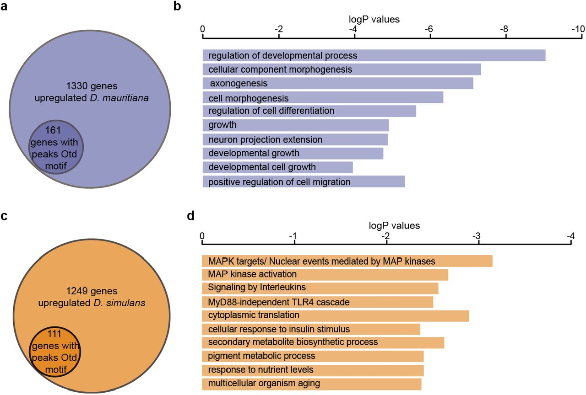

# Abstract

## Eye size   
**Drosophila {drə'sɒfɪlə} mauritiana > Drosophila simulans** 
+ Previous finding: mauritiana have more ommatidia numbers 
+ Now: [[Bio-dict#^ef05d9|orthodenticle]] in mauritiana is expressed earlier, may have a impact

![[Bio-dict#^b620ba|ommatidia]]

By ATAC-seq, identified:
+ eye enhancers of Otd 
+ potential direct targets of this Transcription factor that expressed between two species

![[Bio-dict#^7afcc6]]

# Introduction

**Understanding the genetic and genomic basis of phenotypic (表型的) diversity is one of the central themes of evolutionary biology.**

## Variation
Size and shape of insects' *compound eyes* are various, which affect:
+ optical parameters
+ visual sensation

Also *ommatidia* size and number are different between species, effects for example:
+ `wider ommatidia` capture more light, which can increase contrast sensitivity; *larger interommatidial* angles can lead to decreased acuity
+ `small ommatidia` with narrow interommatidial angles can enhance acuity, but this may decrease contrast sensitivity

In addition, one specie with several *sizes* of ommatidia is also exist:
+ for different visual tasks
	+  wider,  flattened, anterior ommatidia of killer flies to maximise contrast sensitivity

### Closely related species of Drosophila
Extensive variation in eye size caused by:
+ differences in  ommatidia  number  and/or  ommatidia  area

## Know little
Genetic  and  developmental  bases  for  variation  in  eye  size  even  among Drosophila species

## D. mauritiana and D. simulans
QTL: 33% difference 

![[Bio-dict#^367406]]

Introgression: mauritiana -> simulans ; increase eye and ommatidial size of simulans

Find positional candidate genes that are differentially expressed in the developing ommatidia between these two species using:
+ higher resolution mapping of X-linked QTL
+ transcriptomic analysis of eye imaginal discs

![[Bio-dict#^33e88a]]

# Results

## Enlarged ommatidia in D. mauritiana
Differences showed in *all* ommatidia?
To examine:
+ Imaging the eyes of these two species using *SRμCT*
+ measuring the facet diameter of ommatidia in different regions of the eye using a 3D reconstruction

![[Bio-dict#^47a5f9]]

D. mauritiana has larger facets, particularly pronounced in the *antero-ventral* (前腹侧) region of the eye.

## Differentially expressed genes in a candidate region on the X chromosome
Introgression from D. mauritiana TAM16 into D. simulans YVF significantly increased the eye size of the latter

Data suggest the *candidate QTL* is located in a maximum region of just over 662 kb

RNA-seq experiments on the eye-antennal imaginal discs of 3rd instar larvae (L3). RNA from D. mauritiana and D. simulans eye-antennal discs at *three* different developmental points:
+ 72 hours after egg laying (AEL; late L2) - specification of the ommatidial cells not yet started
+ 96 h AEL stage (mid L3) - the most posterior ommatidia are already determined 
+ 120 h AEL (late L3) - most ommatidia are already determined 

72 h AEL eye imaginal discs were the most different in comparison to transcriptomes from both 96 h AEL and 120 h AEL for both species 

For 0.66 Mb X-linked region:
+ 49 of 62 genes were expressed in at least one of the RNA-seq datasets 
+ only *8* were differentially expressed between the eye discs of these two species at 120 h AEL

Next performed *in situ hybridization experiments* of these 8 candidate genes

![[Bio-dict#^51111e]]

According  to the result, *Otd* is already expressed in several rows of most posterior ommatidia of D. mauritiana eye discs, whereas, Otd expression is undetectable in the most posterior regions of the eye discs of D. simulans

As a result ==Otd is the only differentially expressed positional candidate gene== that is expressed in maturing ommatidia

## Differences in Otd gene expression during eye development between two species  

Otd transcription in the maturing ommatidia initiates earlier in D. mauritiana than in D. simulans eye discs

Further, at 110 h AEL, Otd is already expressed in D. mauritiana but not detected in D. simulans  (D. m already exhibits Otd mRNA - red arrowhead below)

## Otd is required for the correct arrangement and size of ommatidia in Drosophila

Loss of otd in clones resulted in disorganised ommatidia with perturbed shapes and sizes – often smaller than those of ommatidia of controls

![[../../assets/Otd_lack.png|300]]

## Differences in chromatin accessibility in the otd locus during eye development 

There is only *1 aa difference* in the Otd sequence between our focal strains, data suggest that the causative changes are located in otd *regulatory regions*.

Microsyntenic conservation between D. melanogaste (黑腹果蝇), D. simulans and D. mauritiana

Doing ATAC-seq on D. simulans and D. mauritiana eye imaginal discs at 96 and 120 h AEL. 

*Four of these peaks showed significant differences in accessibility* between D. mauritiana and D. simulans: 
+ peak 6 (D. sim chrX: 8,100,587-8,100,808, padj = 0.00155) in the 3rd introns of otd;
+ peak 11 (D. sim chrX: 8,107,881-8,108,402, padj = 0.00976) in the 1st introns of otd;
+ peak 17 (D. sim chrX: 8,125,765 - 8,126,410, padj = 0.0418), upstream
+ peak 19 (D. sim chrX: 8,129,876 - 8,131,170, padj = 0.0317), upstream

Furthermore, a fifth peak (*peak 16*) upstream of otd, which did not show differential accessibility within the alignable regions, but high accessibility specifically in two D. mauritiana stretches that are disrupted by two insertions of 55 and 106 nucleotides respectively in D. simulans 

looked for transcription factor binding motifs (TFBMs) and finally identified several regions in the otd locus that may function as new eye enhancers for this gene in D. mauritiana and D. simulans

## Differences in otd targets during eye development between D. simulans and D. mauritiana 

### Whether differences in the onset of expression between 2 species  promoted further changes in its Gene Regulatory Networks (GRNs)

To this end:
+ called open chromatin peaks in each sample 
+ searched for the Otd-binding motif in these accessible regions of genes expressed during eye development.

![[Bio-dict#^507f25]]

There are *1,148* putative (假定的) Otd target genes 

+ peaks associated with *161* of the 1330 genes that are upregulated in D. mauritiana contained Otd binding motifs
+ *111* out of 1249 genes upregulated in D. simulans had associated peaks containing Otd binding motifs

### Gene Ontology (GO) term enrichment analysis

+ The _D. mauritiana_ dataset exhibited enrichment in terms related to developmental processes, cell morphogenesis, axonogenesis (轴突发生), regulation of differentiation or growth, among others 
+ while genes that were upregulated in _D. simulans_ with associated Otd-peaks were enriched in terms such as the MAP kinase network, signalling by interleukins and cellular response to insulin stimulus 

## Ommatidia size differences related to Rh3 expression

Otd directly regulates the expression of _rh3_:

![[../../assets/Otd-Rh3.png|400]]

Tested if the expression of Rh3 in ommatidia may have an impact on the ommatidia diameter

Data suggested exposing maturing ommatidia longer to the action of Otd may quantitatively influence the Rh3 content, rather than the ratio of ommatidia subtypes.

# Discussion

Story:
X linked QTL mapped **->**    
33% of the difference in eye size **->**    
identified 8 positional candidate genes **->**    
deeper analysis suggests otd as the best candidate gene **->**    
knockdown or loss of otd in D. melanogaster perturbs ommatidia size specification **->**    
otd is actually expressed earlier during ommatidial maturation in D. mauritiana **->**    
regulatory landscape of otd identify several candidate cis-regulatory regions that could regulate the eye development **->**    
otd mutants are also differentially expressed in late L3. In particular, several genes involved in phototransduction (e.g. rh3) **->**    
network downstream of Otd varies between these two species **->**    
it is possible that differences in otd expression between these two species causes differences in rhodopsin expression as well as ommatidial size

# Conclusions

Our data suggest that changes in the timing of otd expression underlie differences in ommatidia size and thus overall eye size between D. mauritiana and D. simulans. Our work provides new insights into ommatidia size regulation and the evolution of eye size. Together with evidence from other studies showing that changes in the timing of ey expression contributes to differences in ommatidia number in Drosophila (Ramaekers et al., 2019), we now have a better understand the genetic and developmental mechanisms that underlie the large diversity in Drosophila eye size (Arif et al., 2013; Buchberger et al., 2021; Gaspar et al., 2020; Hilbrant et al., 2014; Keesey et al., 2019; Norry and Gomez, 2017; Posnien et al., 2012; Ramaekers et al., 2019; Reis et al., 2020).     
Moreover, this evidence suggests that changes in the temporal expression of upstream TFs is a widespread mechanism responsible for morphological evolution. What is also clear is the the potential this system has to build on our existing knowledge of Drosophila eye development (Casares and Almudi, 2016; Casares and McGregor, 2021; Domínguez and Casares, 2005; Gaspar et al., 2019; Kumar, 2018) to ultimately better understand the specification and evolution of organ size more generally.

我们的数据表明，OTD表达的时间的变化是导致小眼大小的差异进而导致D. Mauritiana和D. simulans整体眼睛大小的基础。我们的工作为小眼尺寸的调节和眼睛尺寸的进化提供了新的见解。与其他研究的证据一起表明，表达时间的变化有助于果蝇小眼数量的差异(Ramaekers 等，2019) ，我们现在更好地了解了果蝇眼睛大小多样性的遗传和发育机制。    
此外，这一证据表明，上游转录因子的时间表达的变化是一个广泛的机制负责形态进化。同样清楚的是，这个系统的潜力必须建立在我们现有的果蝇眼睛发育知识的基础上 ，以最终更好地理解更广泛的器官大小的规格和进化。