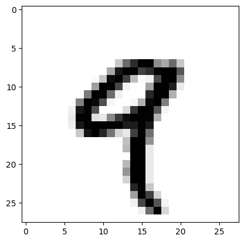

---
cssclasses:
  - Python
tags:
  - AI
---
# Intro 

Understand the relation between machine learning, deep learning and Artificial intelligence:


## AI
Born in 1950.
+ 符号人工智能 (Symbolic AI) 1950s - 1980s
	+ *suitable to* solve well-defined, logical problems, such as playing chess
	+ *hard to* solving more complex, fuzzy problems, such as image classification
+ 数字人工智能 (Numeric AI)
	+ The core of Numeric AI is machine learning

## Machine learning 
The usual way to make a computer do useful work is to have a human programmer write down rules — a computer program — to be followed to turn input data into appropriate answers;

A machine learning system is trained rather than explicitly programmed.

![[../../../assets/Coding/Machine_learning.png|300]]

Related to **mathematical statistics**, but it differs from statistics in several important ways 

### Learning rules and representations from data

To define deep learning and understand the *difference between deep learning and other machine learning approaches*, first we need some idea of what machine learning algorithms do.

To do `machine learning`, we need three things: 
+ **Input data points** — For instance, if the task is image tagging, they could be pictures.
+ **Examples of the expected output** — In an image task, expected outputs could be tags such as “dog,” “cat,” and so on.
+ **A way to measure whether the algorithm is doing a good job** — This is necessary in order to determine the distance between the algorithm’s current output and its expected output. The measurement is used as a feedback signal to adjust the way the algorithm works. This adjustment step is what we call learning.

What is a representation? - A different way to look at data, to represent or encode data: For example, a colour image can also be showed by using RGB values or HSV data.

Here is an example:

![[../../../assets/Coding/Coordinate.jpeg]]

To develop an algorithm that can take distinct point and output whether that
point is likely to be black or to be white. Using raw data is not easy to do, but the use of new coordinate system and represent well, we can see white point are those x < 0 and black > 0.

**Hypothesis space?**
A set of functions that a machine learning algorithm can generate. In layman's terms, this is a collection of all the possibilities of the sample.

### "Deep" in Deep-learning
How many layers contribute to a model of the data is called the `depth` of the model.

Other appropriate names for the field could have been *layered representations learning* or *hierarchical representations learning*.

These layered representations are learned via models called *neural networks*.

A deep learning algorithm look like:
![[../../../assets/Coding/Data representations.png|500]]

Machine learning is about mapping inputs (such as images) to targets (such as the label “cat”), which is done by observing many examples of input and targets. You also know that deep neural networks do this input-to-target mapping via a deep sequence of simple data transformations (layers) and that these data transformations are learned by exposure to examples.

A deep learning workflow:
![[../../../assets/Coding/Deep_learning_workflows.png|600]]

Initially, the weights of the network are assigned *random values*, so the network merely implements a series of random transformations. Naturally, its output is far from what it should ideally be, and the loss score is accordingly very high. But with every example the network processes, the weights are adjusted a little in the correct direction, and the loss score decreases. This is the training loop, which, repeated a sufficient number of times (typically tens of iterations over thousands of examples), yields weight values that minimize the loss function. A network with a minimal loss is one for which the outputs are as close as they can be to the targets: a trained network.

## First deep-learning

Get `train_images` and `train_labels` form the training set, the data that the model will learn from. The model will then be tested on the test set, `test_images` and `test_labels`

The images are encoded as NumPy arrays, and the labels are an array of digits, ranging from 0 to 9. The images and labels have a one-to-one correspondence.
```python
from tensorflow.keras.datasets import mnist
(train_images, train_labels), (test_images, test_labels) = mnist.load_data()
```

For train data:
```python
train_images.shape
```
    (60000, 28, 28)

```python
len(train_labels)
```
    60000

```python
train_labels
```
    array([5, 0, 4, ..., 5, 6, 8], dtype=uint8)


For test data
```python
test_images.shape
```
    (10000, 28, 28)

```python
test_labels
```
    array([7, 2, 1, ..., 4, 5, 6], dtype=uint8)

The workflow will be as follows: 
+ First, we’ll feed the neural network the training data, train_images and train_labels.
+ The network will then learn to associate images and labels. 
+ Finally, we’ll ask the network to produce predictions for test_images, and we’ll verify whether these predictions match the labels from test_labels. 

### The network architecture:
```python
from tensorflow import keras 
from tensorflow.keras import layers
model = keras.Sequential([
 layers.Dense(512, activation="relu"),
 layers.Dense(10, activation="softmax")
])
```

Core building block of neural networks is the layer. 

A layer can be seen as a filter for data: some data goes in, and it comes out in a more useful form. Specifically,
layers extract representations out of the data fed into them

In the model below, which consists of a sequence of two Dense layers

### The compilation step
```python
model.compile(optimizer="rmsprop",  # An optimizer
 loss="sparse_categorical_crossentropy",  # A loss function
 metrics=["accuracy"])  # Metrics to monitor during training and testing
```

### Reshaping
Make all values are in the [0, 1] interval. 

`train_images.shape` is (60000, 28, 28) with values in the [0, 255] interval
```python
train_images = train_images.reshape((60000, 28 * 28))
train_images = train_images.astype("float32") / 255
test_images = test_images.reshape((10000, 28 * 28))
test_images = test_images.astype("float32") / 255
```

### Fitting model
```python
model.fit(train_images, train_labels, epochs=5, batch_size=128)
```
    Epoch 1/5
    469/469 [==============================] - 4s 8ms/step - loss: 0.0317 - accuracy: 0.9909
    Epoch 2/5
    469/469 [==============================] - 4s 8ms/step - loss: 0.0242 - accuracy: 0.9927
    Epoch 3/5
    469/469 [==============================] - 4s 8ms/step - loss: 0.0181 - accuracy: 0.9949
    Epoch 4/5
    469/469 [==============================] - 4s 8ms/step - loss: 0.0131 - accuracy: 0.9968
    Epoch 5/5
    469/469 [==============================] - 4s 8ms/step - loss: 0.0105 - accuracy: 0.9975
    <keras.callbacks.History at 0x242b3283f50>

### Predictions

```python
test_digits = test_images[0:10]
predictions = model.predict(test_digits)
```
    1/1 [==============================] - 0s 134ms/step

```python
predictions[0]
```
    array([1.7191756e-10, 4.9179261e-11, 7.5323115e-08, 9.6685017e-07,
           1.2594488e-14, 3.3588111e-11, 5.9833228e-14, 9.9999893e-01,
           5.3525708e-11, 1.0359777e-08], dtype=float32)

```python
predictions[0].argmax() 
```
    7

```python
predictions[0][7] 
```
    0.9999989

### Evaluating the model on new data
```python
test_loss, test_acc = model.evaluate(test_images, test_labels)
print(f"test_acc: {test_acc}")
```
    313/313 [==============================] - 1s 2ms/step - loss: 0.0605 - accuracy: 0.9821
    test_acc: 0.9821000099182129

## Tensor 
Actually, they are multidimensional NumPy arrays.


All current machine learning systems use tensors as their basic data structure. 

### Scalars - 标量 - rank-0 tensors
```python
import numpy as np
x = np.array(12)
x.ndim 
```
    0

### Vectors - 向量 - rank-1 tensors
```python
x = np.array([12, 3, 6, 14, 7])
x.ndim
```
    1

This vector has five entries and so is called a 5-dimensional vector.

**A 5D vector has only one axis and has five dimensions along its axis;**     
**Whereas a 5D tensor has five axes (and may have any number of dimensions along each axis).**

> The rank of a tensor being the number of axes

### Matrices - 矩阵 - rank-2 tensors
```python
x = np.array([[5, 78, 2, 34, 0],
              [6, 79, 3, 35, 1],
              [7, 80, 4, 36, 2]])
x.ndim 
```
    2

### 更高的Rank
```python
x = np.array([[[5, 78, 2, 34, 0],
               [6, 79, 3, 35, 1],
               [7, 80, 4, 36, 2]],
               [[5, 78, 2, 34, 0],
                [6, 79, 3, 35, 1],
                [7, 80, 4, 36, 2]],
                [[5, 78, 2, 34, 0],
                 [6, 79, 3, 35, 1],
                 [7, 80, 4, 36, 2]]])
x.ndim
```
    3

### Key attributes
A tensor is defined by three key attributes:
+ Number of axes (rank) — For instance, a rank-3 tensor has three axes;
+ Shape — This is a tuple of integers that describes how many dimensions the tensor has along each axis;
+ Data type (usually called dtype in Python libraries)—This is the type of the data contained in the tensor; for instance, a tensor’s type could be float16, float32, float64, uint8, and so on.


```python
x_2 = np.array(
[
    [
         [1., 1., 1., 1.],
         [1., 1., 1., 1.],
         [1., 1., 1., 1.]
    ],

    [
         [1., 1., 1., 1.],
         [1., 1., 1., 1.],
         [1., 1., 1., 1.]
    ]
]
)
x_2.shape
```
    (2, 3, 4)

Shape detailed:
+ 第一层（最外层）中括号里面包含了两对中括号（以逗号进行分割），这就是（2，3，4）中的 2
+ 第二层中括号里面包含了三对中括号（以逗号进行分割），这就是（2，3，4）中的 3
+ 第三层中括号里面包含了四个数（以逗号进行分割），这就是（2，3，4）中的 4

So, for training data, these 3 attributes are:
```
>>> train_images.ndim 
3 
```
Here’s its shape:
```
>>> train_images.shape
(60000, 28, 28)
```
And this is its data type, the dtype attribute:
```
>>> train_images.dtype
uint8
```

It is a rank-3 tensor of 8-bit integers. More precisely, it’s an array of 60,000 matrices of 28 × 28 integers

### Display the fourth digit in this rank-3 tensor
```python
%matplotlib inline
import matplotlib.pyplot as plt
from tensorflow.keras.datasets import mnist

(train_images, train_labels), (test_images, test_labels) = mnist.load_data()
digit = train_images[4]
plt.imshow(digit, cmap=plt.cm.binary)
plt.show()
```

​ 
The label should be 9
```python
train_labels[4]
```
    9

### Manipulating tensors
```python
my_slice = train_images[10:100]
my_slice.shape
```
    (90, 28, 28)

That is the same as:
```
my_slice = train_images[10:100, :, :]
my_slice = train_images[10:100, 0:28, 0:28]
```

Other examples:
```python
#  bottom-right corner of all images,
my_slice_2 = train_images[:, 14:, 14:]
my_slice_2.shape
```
    (60000, 14, 14)

```python
# 14 × 14 pixels centered in the middle, you’d do this:
my_slice_3 = train_images[:, 7:-7, 7:-7]
```

### Notion of data batches
In general, the first axis (axis 0, because indexing starts at 0) in all data tensors you’ll come across in deep learning will be the samples axis.

In the MNIST example, “samples” are images of digits.

Deep learning models don’t process an entire dataset at once; rather, they *break the data into small batches*. Concretely, here’s one batch of our MNIST digits, with a batch size of 128:

```python
batch = train_images[:128]
batch_2 = train_images[128:256]
# and soon
```

### Real-world examples of data tensors
+ Vector data - Rank-2 tensors of shape (samples, features), where each sample is a vector of numerical attributes (“features”) 
First axis is the samples axis and the second axis is the features axis

1. Timeseries data or sequence data - Rank-3 tensors of shape (samples, timesteps, features), where each sample is a sequence (of length timesteps) of feature vectors
   + A example is: A dataset of stock prices. Every minute, we store the current price of the stock, the highest price in the past minute, and the lowest price in the past minute. Thus, every minute is encoded as a 3D vector, an entire day of trading is encoded as a matrix of shape (390, 3) (there are 390 minutes in a trading day), and 250 days’ worth of data can be stored in a rank-3 tensor of shape (250, 390, 3). Here, each sample would be one day’s worth of data.


2. Images - Rank-4 tensors of shape (samples, height, width, channels), where each sample is a 2D grid of pixels, and each pixel is represented by a vector of values (“channels”)

   + Images typically have three dimensions: height, width, and color depth. Although grayscale images (like our MNIST digits) have only a single color channel and could thus be stored in rank-2 tensors


There are two conventions for shapes of image tensors: the channels-last convention
(which is standard in TensorFlow) and the channels-first convention (which is increasingly falling out of favor).
 The channels-last convention places the color-depth axis at the end: (samples,
height, width, color_depth). Meanwhile, the channels-first convention places the
color depth axis right after the batch axis: (samples, color_depth, height, width).
With the channels-first convention, the previous examples would become (128, 1, 256, 256) and (128, 3, 256, 256). The Keras API provides support for both formats.

3. Video - Rank-5 tensors of shape (samples, frames, height, width, channels), where each sample is a sequence (of length frames) of images 

Because each frame can be stored in a rank-3 tensor (height, width, color_ depth), a sequence of frames can be stored in a rank-4 tensor (frames, height, width, color_depth), and thus a batch of different videos can be stored in a rank-5 tensor of shape (samples, frames, height, width, color_depth). 

For instance, a 60-second, 144 × 256 video clip sampled at 4 frames per second would have 240 frames. A batch of four such video clips would be stored in a tensor of shape (4, 240, 144, 256, 3).
